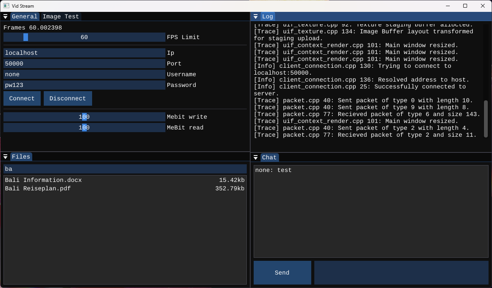

# Vid Stream
A client-server project fully programmed in C++. It features a simple packet
manager and a UI built with ImGui. Currently Windows only.

## Requirements
- Windows 7 or newer
- CMake 3.20+
- Vulkan SDK 1.4+
- Ninja or Make

## Build
The server and client are built individually. Use these commands to build and run:

```bash
cmake -B build-release\ -S . -G "Ninja" -DCMAKE_BUILD_TYPE=Release
ninja -C build-release\
start build-release\bin\vid_stream_client.exe
start build-release\bin\vid_stream_server.exe
```

## What works
- Password and port configuration for the server
- Client-side login data persistence
- Broadcast chat for all connected users
- File upload via drag and drop
- File download and deletion from the client UI
- File list with name and size
- File search bar in the file window
- Configurable upload and download rate limits
- Screen capture via DXGI

## Architecture
- **Logger** – Macro-based logging with multiple log levels and log file support
- **Packet Manager** – Network traffic handling and rate limiting using the ASIO library
- **UI Frame** – Vulkan backend, GLFW and ImGui integration
- **Capture API** – Screen capture on the client side via DXGI (Windows only)
- **Client & Server** – Separate CMake projects, both sharing the packet manager and logger

## Preview

